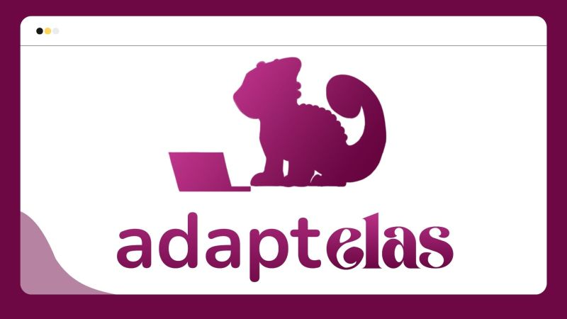

# Atividade – Git/GitHub do curso Adaptelas

## Instruções da Atividade

### 1) Instale o VSCode
 Visual Studio Code (VSCode) é um editor de código-fonte desenvolvido pela Microsoft. Siga os seguintes passos para instalar o VSCode:

- Acesse o site oficial do VSCode: https://code.visualstudio.com/
- Baixe a versão apropriada para o seu sistema operacional (Windows, macOS, Linux).

Siga as instruções de instalação fornecidas pelo site.

### 2) Instale o Git
 Git é um sistema de controle de versão distribuído gratuito e de código aberto. Siga os seguintes passos para instalar o Git:

- Acesse o site oficial do Git: https://git-scm.com/
- Baixe a versão apropriada para o seu sistema operacional (Windows, macOS, Linux).

Siga as instruções de instalação fornecidas pelo site.

### 3) Crie uma conta no GitHub

 GitHub é uma plataforma de hospedagem de código-fonte com controle de versão usando o Git. 
 Siga os seguintes passos para criar uma conta no GitHub:

- Acesse o site oficial do GitHub: https://github.com/

- Clique em "Sign up" no canto superior direito.
- Preencha o formulário de registro com seu e-mail, senha e nome de usuário.

Siga as instruções fornecidas pelo site para completar o registro.

### 4) Crie um repositório no GitHub e faça o Commit de um arquivo de texto
 Agora que você tem o Git e o VSCode instalados e uma conta no GitHub, siga os seguintes passos para criar um repositório e fazer um commit:

## Configuração do Repositório Git

## Comandos

- git init
- git add .
- git commit -m "Primeiro Commit"
- git branch -M main
- git remote add origin "https://github.com/Mpbarcelo/Adaptelas-aula01"
- git push -u origin main
## Explicação dos Comandos
- git init: Inicializa um novo repositório Git.
- git add .: Adiciona todos os arquivos no diretório atual ao índice do Git.
- git commit -m "Primeiro Commit": Faz o commit das mudanças com a mensagem "Primeiro Commit".
- git branch -M main: Renomeia a branch atual para "main".
- git remote add origin "https://github.com/Mpbarcelo/Adaptelas-aula01": Adiciona um repositório remoto com o URL fornecido.
- git push -u origin main: Envia as mudanças para o repositório remoto e define "origin/main" como a branch upstream padrão.

Certifique-se de executar esses comandos no terminal dentro do diretório do seu projeto para configurar o repositório corretamente.
